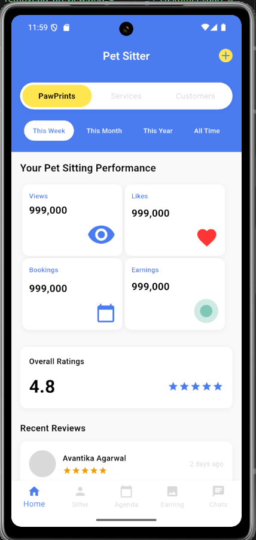
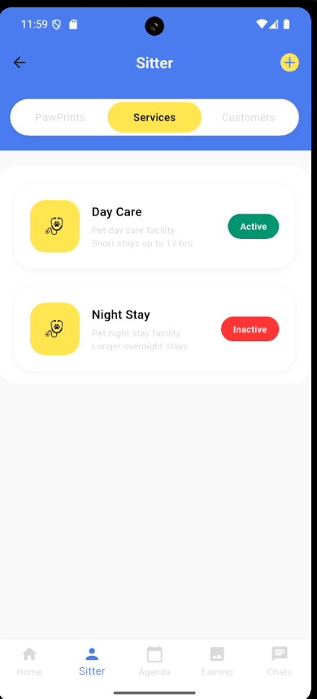

## 📸 Screenshots

### Dashboard

### Services

### Customers

## 🎯 Key Highlights

- Clean & readable code
- Reusable widgets
- Centralized color constants
- UI consistency across screens
- Scalable structure for backend integration

## 🚀 Future Enhancements

- API integration
- State management (Provider / Bloc)
- Search & filter functionality
- Authentication flow

## 🧑Developed By

**Anjali Kumhar**  
Flutter Developer  
